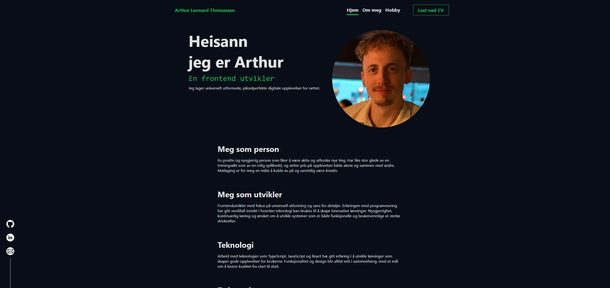

# Arthur Leonard Thomassen - Portefølje

Dette er en enkel porteføljeside laget med **HTML**, **CSS** og **JavaScript**, helt uten rammeverk. Siden presenterer meg som utvikler, min erfaring, utdanning, prosjekter og hobbyer.

## Innhold

- **Forside**: Kort introduksjon og kontaktinformasjon.
- **Om meg**: Erfaring, utdanning og prosjekter.
- **Hobby**: Mine fritidsinteresser med bilder og beskrivelser.

## Teknologi

- Ingen rammeverk brukt.
- Ren HTML, CSS og JavaScript.
- Responsivt design for både mobil og desktop.

## Bruk

Åpne `index.html` i nettleseren for å se siden.

## Kontakt

- [GitHub](https://github.com/Friftycode)
- [LinkedIn](https://linkedin.com/in/arthur90/)
- [E-post](alt.post.inbox+genuinelyfun@gmail.com)
